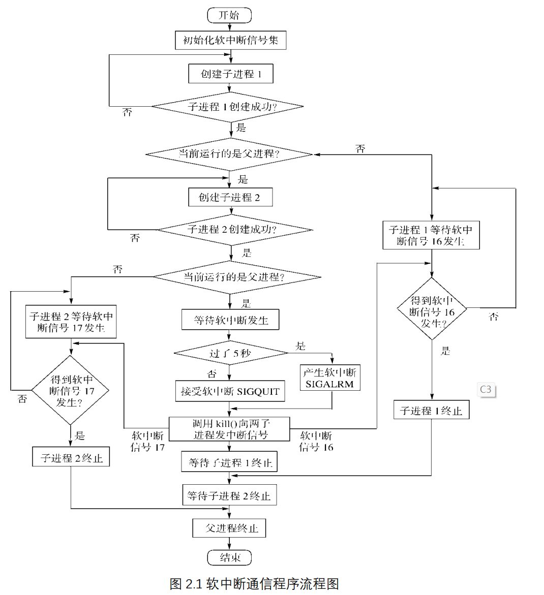

# 实验二 进程通信与内存管理

# 2.1 进程的软中断通信

## 2.1.1 实验目的

编程实现进程的创建和软中断通信，通过观察、分析实验现象，深入理解进程及进程在调度执行和内存空间等方面的特点，掌握在 POSIX 规范中系统调用的功能和使用。

## 2.1.2 实验内容

（ 1）使用 man 命令查看 fork 、 kill 、 signal、 sleep、 exit 系统调用的帮助手册。

（ 2）根据流程图（如图 2.1 所示） 编制实现软中断通信的程序： 使用系统调用 fork()创建两个子进程，再用系统调用 signal()让父进程捕捉键盘上发出的中断信号（即 5s 内按下delete 键或 quit 键），当父进程接收到这两个软中断的某一个后，父进程用系统调用 kill()向两个子进程分别发出整数值为 16 和 17 软中断信号，子进程获得对应软中断信号，然后分别输出下列信息后终止：

Child process 1 is killed by parent !! Child process 2 is killed by parent !!

父进程调用 wait()函数等待两个子进程终止后，输出以下信息，结束进程执行： Parent process is killed!!

注： delete 会向进程发送 SIGINT 信号， quit 会向进程发送 SIGQUIT 信号。 ctrl+c 为delete， ctrl+\为 quit 。

（ 3）多次运行所写程序，比较 5s 内按下 Ctrl+\或 Ctrl+Delete 发送中断，或 5s 内不进行任何操作发送中断， 分别会出现什么结果？分析原因。

（ 4）将本实验中通信产生的中断通过 14 号信号值进行闹钟中断，体会不同中断的执行样式，从而对软中断机制有一个更好的理解

## 2.1.3 实验前准备

实验相关 UNIX 系统调用介绍：

(1)fork(): 创建一个子进程。

创建的子进程是 fork 调用者进程(即父进程)的复制品,即进程映像.除了进程标识数以及与进程特性有关的一些参数外,其他都与父进程相同,与父进程共享文本段和打开的文件,并都受进程调度程序的调度。

如果创建进程失败,则 fork()返回值为-1,若创建成功,则从父进程返回值是子进程号,从子进程返回的值是 0。

因为 FORK 会将调用进程的所有内容原封不动地拷贝到新创建的子进程中去,而如果之后马上调用 exec,这些拷贝的东西又会马上抹掉,非常不划算.于是设计了一种叫作” 写时拷贝”的技术,使得 fork 结束后并不马上复制父进程的内容,而是到了真正要用的时候才复制。

(2)exec(): 装入并执行相应文件。

(3)wait():父进程处于阻塞状态,等待子进程终止,其返回值为所等待子进程的进程号.

(4)exit():进程自我终止,释放所占资源,通知父进程可以删除自己,此时它的状态变为P_state= SZOMB,即僵死状态.如果调用进程在执行 exit 时其父进程正在等待它的中止，则父进程可立即得到该子进程的 ID 号。

(5)getpid():获得进程号。

(6)lockf(files,function,size):用于锁定文件的某些段或整个文件。本函数适用的头文件为： #include<unistd.h>,

参数定义： int lockf(files,function,size) int files,founction;

long size;

files 是文件描述符， function 表示锁状态， 1 表示锁定， 0 表示解锁； size 是锁定或解锁的字节数，若为 0 则表示从文件的当前位置到文件尾。

(7)kill(pid,sig)：一个进程向同一用户的其他进程 pid 发送一中断信号。

(8)signal(sig,function): 捕捉中断信号 sig 后执行 function 规定的操作。

头文件为： #include <signal.h>

参数定义： signal(sig,function) int sig;

void (*func) ();其中 sig 共有 19 个值

注意： signal 函数会修改进程对特定信号的响应方式。

(9)pipe(fd);

int fd[2];

其中 fd[1]是写端，向管道中写入， fd[0]是读端，从管道中读出。

(10)暂停一段时间 sleep；

调用 sleep 将在指定的时间 seconds 内挂起本进程。

其调用格式为：“ unsigned sleep(unsigned seconds);” ；返回值为实际的挂起时间。

(11)暂停并等待信号 pause；

调用 pause 挂起本进程以等待信号，接收到信号后恢复执行。当接收到中止进程信号时，该调用不再返回。

其调用格式为“int pause(void);”

在 linux 系统下，我们可以输入 kill -l 来观察所有的信号以及对应的编号



编写实验代码需要考虑的问题：

(1)父进程向子进程发送信号时，如何确保子进程已经准备好接收信号？

(2)如何阻塞住子进程，让子进程等待父进程发来信号？

## 2.1.4 实验步骤

了解kill、wait等系统函数，编写代码，编译运行，观察输出。

## 2.1.5 程序运行初值及运行结果分析

```c
#include <signal.h>
#include <stdio.h>
#include <stdlib.h>
#include <sys/wait.h>
#include <unistd.h>

void signal_handler(int signal_num) {
  // printf("Received interrupt signal: %d\n", signal_num);
}

void child_signal_handler(int signal_num) {
  if (signal_num == 16) {
    printf("Child process 1 is killed by parent !!\n");
  }
  if (signal_num == 17) {
    printf("Child process 2 is killed by parent !!\n");
  }
  exit(0);
}

int main() {
  pid_t child1, child2;
  signal(SIGINT, signal_handler);   //  (Ctrl+C)
  signal(SIGQUIT, signal_handler);  // (Ctrl+\)

  child1 = fork();
  if (child1 == 0) {
    signal(16, child_signal_handler); 
    while (1) {
    }
  }

  child2 = fork();
  if (child2 == 0) {
    signal(17, child_signal_handler); 
    while (1) {
    }
  }

  if (child1 > 0 && child2 > 0) {
    alarm(5);
    pause();

    kill(child1, 16);
    kill(child2, 17);

    // wait two child process to exit
    wait(NULL); 
    wait(NULL);  
    printf("Parent process is killed!!\n");
  }

  return 0;
}
```


观察三次输出可以看到，子进程结束的顺序并不固定，如果超时会通过alarm来退出。这符合我一开始对于程序的设计。因为超时没有传递中断或者退出子进程就无法被结束。（最重要的是alarm信号没有被处理。）现在我希望改进代码，我增加一个alarm_handle：

```c
void signal_handler(int signal_num) {
  if (signal_num == SIGALRM) {
    printf("the signal is timeout proc stopped auto!!\n");
  }
  // printf("Received interrupt signal: %d\n", signal_num);
}
```


此时我发现实验手册要求我使用闹钟中断——alarm，我在前面已经实现完毕。只能说：无巧不成书！

kill命令我只调用了两次。调用后一方面是中断了对应的子进程，另一方面发出了一个signal，输出相关信息。


对于这个问题，我认为可以在进程内调用exit(0)、return等方式来退出。后者更好一些。kill我理解的类似于Windows平台设备管理器的“结束进程”，或者说强制关机，这是一个具有风险的行为，尤其是对于易失性的信息，很可能直接丢失。因此kill不到万不得已不太应该使用。

## 2.1.6 实验总结

### 2.1.6.1 实验中的问题与解决过程

不了解kill、signal相关的调用。查询相关文档学习。

参考代码复杂且难懂，难以完成，最终通过自主重构完成。

### 2.1.6.2 实验收获

我们总是会遇到很多以目前知识无法立刻解决的难题，但是只要保持自信，勇敢挑战自己，不断学习，就能解决难题。

### 2.1.6.3 意见与建议

增加一些验收形式。目前的实验验收形式过于落后。效率极低。在目前实验本身价值有限的情况下，浪费了同学更浪费了老师和助教的大量时间。

## 2.1.7 附件

### 2.1.7.1 附件1 程序

[2.1.1.c](lab2/2.1.1.c)

### 2.1.7.2 附件2 Readme

[lab2-1Readme.md](lab2/lab2-1Readme.md)

# 2.2 进程的管道通信

## 2.2.1 实验目的

编程实现进程的管道通信，通过观察、分析实验现象，深入理解进程管道通信的特点，掌握管道通信的同步和互斥机制。

## 2.2.2 实验内容

（ 1）学习 man 命令的用法，通过它查看管道创建、同步互斥系统调用的在线帮助，并阅读参考资料。

（ 2）根据流程图（如图 2.2 所示）和所给管道通信程序，按照注释里的要求把代码补充完整，运行程序，体会互斥锁的作用，比较有锁和无锁程序的运行结果，分析管道通信是如何实现同步与互斥的。


## 2.2.3 实验前准备

所谓“管道”，是指用于连接一个读进程和一个写进程以实现他们之间通信的一个共享文件，又名 pipe 文件。向管道(共享文件)提供输入的发送进程(即写进程)，以字符流形式将大量的数据送入管道；而接受管道输出的接收进程(即读进程)，则从管道中接收(读)数据。由于发送进程和接收进程是利用管道进行通信的，故又称为管道通信。这种方式首创于 UNIX系统，由于它能有效地传送大量数据，因而又被引入到许多其它操作系统中。

为了协调双方的通信，管道机制必须提供以下三方面的协调能力：

 ①互斥，即当一个进程正在对 pipe 执行读/写操作时，其它(另一)进程必须等待。

②同步，指当写(输入)进程把一定数量(如 4KB)的数据写入 pipe，便去睡眠等待，直到读(输出)进程取走数据后，再把他唤醒。当读进程读一空 pipe 时，也应睡眠等待，直至写进程将数据写入管道后，才将之唤醒。

③确定对方是否存在，只有确定了对方已存在时，才能进行通信。

管道是进程间通信的一种简单易用的方法。管道分为匿名管道和命名管道两种。下面首先介绍匿名管道。

匿名管道只能用于父子进程之间的通信，它的创建使用系统调用 pipe()： int pipe(int fd[2])

其中的参数 fd 用于描述管道的两端，其中 fd[0]是读端， fd[1]是写端。两个进程分别使用

读端和写端，就可以进行通信了。

一个父子进程间使用匿名管道通信的例子。

匿名管道只能用于父子进程之间的通信，而命名管道可以用于任何管道之间的通信。命名管道实际上就是一个 FIFO 文件，具有普通文件的所有性质，用 ls 命令也可以列表。但是，它只是一块内存缓冲区。

```c
/*管道通信实验程序残缺版 */
#include <signal.h>
#include <stdio.h>
#include <unistd.h>
int pid1, pid2;  // 定义两个进程变量
int main() {
  int fd[2];
  char InPipe[1000];  // 定义读缓冲区
  char c1 = '1', c2 = '2';
  pipe(fd);  // 创建管道
  while ((pid1 = fork()) == -1)
    ;  // 如果进程 1 创建不成功,则空循环
       // 如果子进程 1 创建成功,pid1 为进程号
  if (pid1 == 0) {
    // 补充:锁定管道
    // 补充:分 2000 次每次向管道写入字符’1’
    sleep(5);  // 等待读进程读出数据
    // 补充:解除管道的锁定
    exit(0);  // 结束进程 1
  } else {
    while ((pid2 = fork()) == -1)
      ;  // 若进程 2 创建不成功,则空循环
    if (pid2 == 0) {
      lockf(fd[1], 1, 0);
      // 补充:分 2000 次每次向管道写入字符’2’
      sleep(5);
      lockf(fd[1], 0, 0);
      exit(0);
    } else {
      // 补充:等待子进程 1 结束
      wait(0);  // 等待子进程 2 结束
      // 补充:从管道中读出 4000 个字符
      // 补充:加字符串结束符
      printf("%s\n", InPipe);  // 显示读出的数据
      exit(0);                 // 父进程结束
    }
  }
```

## 2.2.4 实验步骤

根据残缺代码完善。基于我自己的知识：

```c
#include <signal.h>
#include <stdio.h>
#include <stdlib.h>
#include <sys/types.h>
#include <sys/wait.h>
#include <unistd.h>

int pid1, pid2;

int main() {
  int fd[2];
  char InPipe[1000];
  char c1 = '1', c2 = '2';
  pipe(fd);

  while ((pid1 = fork()) == -1)
    ;  // 如果进程 1 创建不成功,则空循环
       // 如果子进程 1 创建成功,pid1 为进程号
  if (pid1 == 0) {
    lockf(fd[1], 1, 0);  // 锁定管道 0 para means lock until the end
    for (int i = 0; i < 2000; i++) {
      write(fd[1], &c1, 1);
    }                    // 分2000 次每次向管道写入字符’1’
    sleep(5);            // 等待读进程读出数据
    lockf(fd[1], 0, 0);  // 解除管道的锁定
    exit(0);             // 结束进程 1
  } else {
    while ((pid2 = fork()) == -1)
      ;  // 若进程 2 创建不成功,则空循环
    if (pid2 == 0) {
      lockf(fd[1], 1, 0);
      for (int i = 0; i < 2000; i++) {
        write(fd[1], &c2, 1);
      }  // 分2000 次每次向管道写入字符’2’
      sleep(5);
      lockf(fd[1], 0, 0);
      exit(0);
    } else {
      wait(NULL);                 // 等待子进程 1 结束
      wait(0);                    // 等待子进程 2 结束
      read(fd[0], InPipe, 4000);  // 从管道中读出 4000 个字符
      InPipe[4000] = '\0';        // 加字符串结束符
      printf("%s\n", InPipe);     // 显示读出的数据
      exit(0);                    // 父进程结束
    }
  }
}
```


如果注释掉锁


## 2.2.5 运行结果分析


lockf是一种pthread_mutex lock，它可以保证锁定的管道只能被当前thread操作，如果一个thread尝试调用一个锁定的管道，它会进入等待状态。

## 2.2.6实验总结

### 2.2.6.1 实验中的问题与解决过程

无

### 2.2.6.2 实验收获

1. **互斥锁的重要性**：通过这次实验，明确了互斥锁在多进程同步中的重要性。
2. **管道的同步与互斥**：理解了如何通过管道来进行进程间的通信，并通过互斥锁来保证管道的同步与互斥。

### 2.2.6.3 意见与建议

1. **更多的实践**：虽然本次实验提供了对管道和进程同步的基础理解，但更复杂的场景需要进一步的实验来探索。
2. **深入理解API函数**：**`lockf`**, **`wait`**, **`pipe`**等都是非常有用的系统调用，值得深入理解其背后的工作机制。

## 2.2.7 附件

### 2.2.7.1 附件1 程序

[2.2.c](lab2/2.2.c)

### 2.2.7.2 附件2 Readme

[lab2-2Readme.md](lab2/lab2-2Readme.md)

# 2.3 内存的分配与回收

## 2.3.1 实验目的

通过设计实现内存分配管理的三种算法（ FF， BF， WF），理解内存分配及回收的过程及实现思路，理解如何提高内存的分配效率和利用率。

## 2.3.2 实验内容

（ 1）理解内存分配 FF， BF， WF 策略及实现的思路。

（ 2）参考给出的代码思路，定义相应的数据结构，实现上述 3 种算法。每种算法要实现内存分配、回收、空闲块排序以及合并、紧缩等功能。

（ 3）充分模拟三种算法的实现过程，并通过对比，分析三种算法的优劣。

## 2.3.3 实验前准备

关于 OS 的连续内存管理知识

（ 1） 系统区与用户区

内存管理的基础是对内存的划分。最简单的划分就是每部分仅包含连续的内存区域，这样的区域称为分区。内存一般被划分为两部分：操作系统分区和用户进程分区。当系统中同时运行多个进程时，每个进程都需要有自己独占的分区，这样就形成了多个用户进程分区。每个分区都是连续的，作为进程访问的物理内存，其位置和大小可以由基址寄存器和界限寄存器唯一确定。通过这两个寄存器，系统可以将一个进程的逻辑地址空间映射到其物理地址空间，整个系统仅需要一对这样的寄存器用于当前正在执行的进程。进程分区的起址和大小是保存在进程控制块中的，仅在进程运行时才会装载到基址和界限寄存器中。

操作系统内存管理的任务就是为每个进程分配内存分区，并将进程代码和数据装入分区。每当进程被调度，执行前由操作系统为其设置好基址和界限寄存器。进程在执行过程中CPU 会依据这两个寄存器的值进行地址转换，得到要访问的物理地址。进程执行结束并退出内存后，操作系统回收进程所占的分区。下面讨论三种连续内存管理的特点及管理方法。

（ 2） 连续内存管理方法

1) 单一连续区分配

这种分配方式仅适用于单用户单任务的系统，它把内存分为系统区和用户区。系统区仅供 OS 使用，用户区供用户使用，任意时刻内存中只能装入一道程序。

2) 固定分区分配

固定分区分配将用户内存空间划分为若干个固定大小的区域，在每个用户分区中可以装入一个用户进程。内存的用户区被划分成几个分区，便允许几个进程驻留内存。操作系统为了完成对固定分区的管理，必须定义一个记录用户分区大小、分区起始地址及分区是否空闲的数据结构。

3) 动态分区分配

这种分配方式根据用户进程的大小，动态地对内存进行划分，根据进程需要的空间大小分配内存。内存中分区的大小和数量是变化的。动态分区方式比固定分区方式显著地提高了内存利用率。

操作系统刚启动时，内存中仅有操作系统分区和一个空闲分区。随着进程不断运行和退出，原始的空闲分区被分割成了大量的进程分区和不相邻的空闲分区。当一个新的进程申请内存时，系统为其分配一个足够大的空闲分区，当一个进程结束时，系统回收进程所占内存。采用动态分区分配方式时，通常可以建立一个空闲分区链以管理空闲的内存区域。

一般不会存在一个空闲分区，其大小正好等于需装入的进程的大小。操作系统不得不把一个大的空闲分区进行拆分后分配给新进程，剩下的放入空闲分区表。空闲分区表中可能有多个大于待装入进程的分区，应该按照什么策略选择分区，会影响内存的利用率。

（ 3） 常见的动态分区分配算法

1) 首次适应算法。

 在采用空闲分区链作为数据结构时，该算法要求空闲分区链表以地址递增的次序链接。在进行内存分配时，从链首开始顺序查找，直至找到一个能满足进程大小要求的空闲分区为止。然后，再按照进程请求内存的大小，从该分区中划出一块内存空间分配给请求进程，余下的空闲分区仍留在空闲链中。

2) 循环首次适应算法。

 该算法是由首次适应算法演变而形成的，在为进程分配内存空间时，从上次找到的空闲分区的下一个空闲分区开始查找，直至找到第一个能满足要求的空闲分区，并从中划出一块与请求的大小相等的内存空间分配给进程。

3) 最佳适应算法。 

将空闲分区链表按分区大小由小到大排序，在链表中查找第一个满足要求的分区。

4) 最差匹配算法。

 将空闲分区链表按分区大小由大到小排序，在链表中找到第一个满足要求的空闲分区。

（ 4） 动态分区的回收

内存分区回收的任务是释放被占用的内存区域，如果被释放的内存空间与其它空闲分区在地址上相邻接，还需要进行空间合并，分区回收流程如下：

1) 释放一块连续的内存区域。

2) 如果被释放区域与其它空闲区间相邻，则合并空闲区。

3) 修改空闲分区链表。

如果被释放的内存区域（回收区）与任何其它的空闲区都不相邻，则为该回收区建立一个空闲区链表的结点，使新建结点的起始地址字段等于回收区起始地址，空闲分区大小字段等于回收区大小，根据内存分配程序使用的算法要求（按地址递增顺序或按空闲分区大小由小到大排序），把新建结点插入空闲分区链表的适当位置。

如果被释放区域与其它空闲区间相邻，需要进行空间合并，在进行空间合并时需要考虑以下三种不同的情况：

1) 仅回收区的前面有相邻的空闲分区。如图 3-7a 所示，把回收区与空闲分区 R1 合并成一个空闲分区，把空闲链表中与 R1 对应的结点的分区起始地址作为新空闲区的起始地址，将该结点的分区大小字段修改为空闲分区 R1 与回收区大小之和。

2) 仅回收区的后面有相邻的空闲分区。如图 3-7b 所示，把回收区与空闲分区 R2 合并成一个空闲分区，把空闲链表中与 R2 对应的结点的分区起始地址改为回收区起始地址，将该结点的分区大小字段修改为空闲分区 R2 与回收区大小之和。

3) 回收区的前、后都有相邻的空闲分区。如图 3-7c 所示，把回收区与空闲分区 R1、 R2 合并成一个空闲分区，把空闲链表中与 R1 对应的结点的分区起始地址作为合并后新空闲分区的起始地址，将该结点的分区大小字段修改为空闲分区 R1、 R2 与回收区三者大小之和，删去与 R2 分区对应的空闲分区结点。当然，也可以修改分区 R2 对应的结点，而删去 R1 对应的结点。还可以为新合并的空闲分区建立一个新的结点，插入空闲分区链表，删除 R1 和 R2 对应的分区结点。

(5) 内存碎片

一个空闲分区被分配给进程后，剩下的空闲区域有可能很小，不可能再分配给其他的进程，这样的小空闲区域称为内存碎片。最坏情况下碎片的数量会与进程分区的数量相同。大量碎片会降低内存的利用率，因此如何减少碎片就成为分区管理的关键问题。内存中的碎片太多时，可以通过移动分区将碎片集中，形成大的空闲分区。这种方法的系统开销显然很大，而且随着进程不断运行或退出，新的碎片很快就会产生。当然，回收分区时合并分区也会消除一些碎片。

## 2.3.4 实验步骤

- 明确主要功能
  
    1 - Set memory size (default=1024)
    
    2 - Select memory allocation algorithm
    
    3 - New process
    
    4 - Terminate a process
    
    5 - Display memory usage
    
    0 - Exit
    
    通过键盘输入选择。
    
- 主要的基础数据结构
  
    1） 内存空闲分区的描述
    
    ```c
    /*描述每一个空闲块的数据结构*/ struct free_block_type {
      int size;
      int start_addr;
    
      struct free_block_type *next;
    };
    
    /*指向内存中空闲块链表的首指针*/ struct free_block_type *free_block;
    ```
    
    2） 描述已分配的内存块
    
    ```c
    /*每个进程分配到的内存块的描述*/ struct allocated_block {
      int pid;
      int size;
    
      int start_addr;
    
      char process_name[PROCESS_NAME_LEN];
      struct allocated_block *next;
    };
    
    /*进程分配内存块链表的首指针*/
    
    struct allocated_block *allocated_block_head = NULL;
    ```
    
    3） 常量定义
    
    ```c
    #define PROCESS_NAME_LEN 32 /*进程名长度*/
    #define MIN_SLICE 10 /*最小碎片的大小*/
    #define DEFAULT_MEM_SIZE 1024 /*内存大小*/
    #define DEFAULT_MEM_START 0 /*起始位置*/
    /* 内存分配算法 */
    #define MA_FF 1
    #define MA_BF 2
    #define MA_WF 3
    int mem_size = DEFAULT_MEM_SIZE; /*内存大小*/
    int ma_algorithm = MA_FF; /*当前分配算法*/
    static int pid = 0; /*初始 pid*/
    int flag = 0; /*设置内存大小标志*/
    ```
    
- 主要模块
  
    ```c
    int main() {
      char choice;
      pid = 0;
      free_block = init_free_block(mem_size);  // 初始化空闲区
      while (1) {
        display_menu();
        fflush(stdin);
        choice = getchar();
        switch (choice) {
          case '1':
            set_mem_size();
            break;
          case '2':
            set_algorithm();
            flag = 1;
            break;
          case '3':
            new_process();
            flag = 1;
            break;
          case '4':
            kill_process();
            flag = 1;
            break;
          case '5':
            display_mem_usage();
            flag = 1;
            break;
          case '0':
            do_exit();
            exit(0);
          default:
            break;
        }
      }
    }
    ```
    
    /*初始化空闲块，默认为一块，可以指定大小及起始地址*/
    
    ```c
    struct free_block_type *init_free_block(int mem_size) {
      struct free_block_type *fb;
      fb = (struct free_block_type *)malloc(sizeof(struct free_block_type));
      if (fb == NULL) {
        printf("No mem\n");
        return NULL;
      }
      fb->size = mem_size;
      fb->start_addr = DEFAULT_MEM_START;
      fb->next = NULL;
      return fb;
    }
    ```
    
    /*显示菜单*/
    
    ```c
    void display_menu() {
      printf("\n");
      printf("1 - Set memory size (default=%d)\n", DEFAULT_MEM_SIZE);
      printf("2 - Select memory allocation algorithm\n");
      printf("3 - New process \n");
      printf("4 - Terminate a process \n");
      printf("5 - Display memory usage \n");
      printf("0 - Exit\n");
    }
    ```
    
    /*设置内存的大小*/
    
    ```c
    void set_mem_size() {
      int size;
      if (flag != 0) {
        printf("Cannot set memory size again\n");
        return;
      }
      printf("set memory_size to: ");
      scanf("%d", &size);
      if (size > 0) {
        mem_size = size;
        free_block->size = mem_size;
      }
      flag = 1;
    }
    ```
    
    /* 设置当前的分配算法 */
    
    ```c
    void set_algorithm() {
      int algorithm;
      printf("\t1 - First Fit\n");
      printf("\t2 - Best Fit \n");
      printf("\t3 - Worst Fit \n");
      scanf("%d", &algorithm);
      if (algorithm >= MA_FF && algorithm <= MA_WF) {
        ma_algorithm = algorithm;
      }
      rearrange(ma_algorithm);
    }
    ```
    
    /*按指定的算法整理内存空闲块链表*/
    
    ```c
    void rearrange(int algorithm) {
      switch (algorithm) {
        case MA_FF:
          rearrange_FF();
          break;
        case MA_BF:
          rearrange_BF();
          break;
        case MA_WF:
          rearrange_WF();
          break;
        default:
          printf("Invalid algorithm.\n");
      }
    }
    ```
    
    /*按 FF 算法重新整理内存空闲块链表*/
    
    /*按 BF 算法重新整理内存空闲块链表*/
    
    /*按 WF 算法重新整理内存空闲块链表*/
    
    /*创建新的进程，主要是获取内存的申请数量*/
    
    /*分配内存模块*/
    
    /*删除进程，归还分配的存储空间，并删除描述该进程内存分配的节点*/
    
    /*释放 ab 数据结构节点*/
    
    /* 显示当前内存的使用情况，包括空闲区的情况和已经分配的情况 */
    
    ```c
    void display_mem_usage() {
      struct free_block_type *fbt = free_block;
      struct allocated_block *ab = allocated_block_head;
    
      if (fbt == NULL) {
        printf("No free memory blocks\n");
        return;
      }
    
      printf("----------------------------------------------------------\n");
      printf("Free Memory:\n");
      printf("%20s %20s\n", "start_addr", "size");
      while (fbt != NULL) {
        printf("%20d %20d\n", fbt->start_addr, fbt->size);
        fbt = fbt->next;
      }
      printf("\nUsed Memory:\n");
      printf("%10s %20s %10s %10s\n", "PID", "ProcessName", "start_addr", "size");
      while (ab != NULL) {
        printf("%10d %20s %10d %10d\n", ab->pid, ab->process_name, ab->start_addr,
               ab->size);
        ab = ab->next;
      }
    
      printf("----------------------------------------------------------\n");
    }
    ```
    

完善补充各个模块代码，最终构建成功正确的项目代码。

## 2.3.5 测试数据设计

不断地rearrange算法以及创建和terminate proc即可。

## 2.3.6 程序运行初值及运行结果分析


## 2.3.7 实验总结

### 2.3.7.1 实验中的问题与解决过程

我没有遇到问题。理解问题的实质后就只是coding问题。

### 2.3.7.2 实验收获

- **First Fit (FF)**
  
    算法思想
    
    在 First Fit 算法中，分配器会扫描空闲块列表，找到第一个足够大的空闲块，并将其分配出去。如果该空闲块大于请求的内存，则会分割该块。
    
    优缺点
    
    - **优点**: 查找速度相对较快，因为一旦找到合适的空闲块，立即停止搜索。
    - **缺点**: 容易导致内存碎片，特别是外部碎片。
    
    提高查找性能
    
    在本次实验中好像并无。
    
- **Best Fit (BF)**
  
    算法思想
    
    Best Fit 算法在所有的空闲块中找到与请求最匹配（即最接近）的空闲块。这通常需要扫描整个空闲块列表。
    
    优缺点
    
    - **优点**: 最小化了每次分配后的剩余空间，从而减少了浪费。
    - **缺点**: 查找性能较差，因为通常需要扫描整个列表；可能导致更多小的空闲块，进而增加碎片。
    
    提高查找性能
    
    维护一个按照大小排序的空闲块列表来提高查找性能。
    
- **Worst Fit (WF)**
  
    算法思想
    
    Worst Fit 算法选择最大的可用空闲块进行分配，假设剩下的空间可能更有用。
    
    优缺点
    
    - **优点**: 理论上，选择最大的空闲块应该能减少碎片。
    - **缺点**: 在实践中，通常并不比其他算法好，查找性能也通常是最差的。
    
    提高查找性能
    
    维护一个按大小排序的空闲块列表来提高查找性能。
    

对于FF的空闲块排序（事实上是不需要排序的，因为无论如何排列，只要找到第一个可用的就行），对于BF、WF我采用了相同的排序算法——归并排序，这是一种稳定的且速度极快的排序算法，对于提升内存分配速率有很大作用。

- 内碎片
  
    由于我们对于最小碎片长度有要求，一个空闲块的大小enough但是并不sufficient。比如在我们的实验中最小的碎片长度为10，一个空闲块大小为28，现在要给他分配一个20大小的proc，只能剩下8，如果被切出，不符合要求，因此28要一次性分配给proc。（此时proc的size是否应该保持为request_size（20）而不是28？我个人认为要记录为28，无论这8个空间是否被proc使用，但是其所“占用”的就是这么大，对于其他proc的影响也是这么大）
    
- 外碎片
  
    由于我们的多次申请空间释放空间导致的长度小于最小值的碎片。例如经过一系列行为，导致701—705的空间为free的，但是显然这部分空间永远无法被使用到。
    
    内存紧缩解决的就是这种碎片。
    
- 回收内存时。空闲块合并主要是通过insertion sort实现，根据空闲块的地址排序，如果空闲块的内存是连续的，那就将其合并为一个块。

### 2.3.7.3 意见与建议

本次实验具有一定的意义。继续保留，我认为可以调整为必做实验而非选做实验。

## 2.3.8 附件

### 2.3.8.1 附件1 程序

[2.3.h](lab2/2.3.h)

[2.3.c](lab2/2.3.c)

### 2.3.8.2 附件2 Readme

[lab2-3Readme.md](lab2/lab2-3Readme.md)