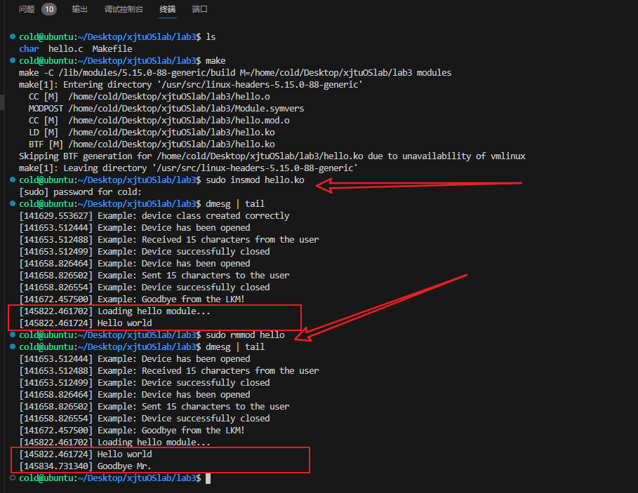

# 实验三 Linux动态模块与设备驱动

## 3.1 实验目的

本实验旨在深入理解Linux操作系统的内核模块和设备驱动程序的工作原理和实现方法。通过本实验，我们将能够：

1. 掌握Linux内核模块的动态加载和卸载机制。内核模块是Linux内核的重要组成部分，能够在系统运行时动态加载和卸载，从而提供了一种灵活和高效的方式来扩展内核功能，而无需重新编译整个内核。
2. 理解和实践字符设备驱动程序的编写。字符设备驱动程序是操作系统与字符设备交互的关键组件，能够处理如键盘、鼠标等设备的输入和输出。通过编写和测试一个简单的字符设备驱动程序，学生将学会如何管理和控制这类设备。
3. 学习设备文件的创建和使用。设备文件在用户空间提供了一种与设备驱动程序交互的机制。本实验将指导学生如何创建和使用这些文件，以便与编写的设备驱动程序进行通信。
4. 增强对Linux内核编程的实践经验。通过亲自编写内核模块和设备驱动程序，学生将获得宝贵的实践经验，这对于理解更复杂的内核机制和未来的系统级编程至关重要。

通过完成这些任务，不仅能够获得对Linux内核模块和设备驱动程序工作原理的深刻理解，还能够在实际编程中应用这些理论知识，为未来的高级系统编程打下坚实的基础。

## 3.2 实验内容

本实验内容涉及以下几个核心部分：

1. **编写基本的Linux内核模块**：首先，学生将编写一个简单的Linux内核模块。这个模块包括初始化（加载）和清理（卸载）两个基本函数。模块的目的是在加载时向系统日志输出一条信息，并在卸载时输出另一条信息，以此来验证模块的动态加载和卸载机制。
2. **编译和加载内核模块**：需要编写Makefile来编译内核模块，并使用Linux系统的内核模块工具（如 **`insmod`** 和 **`rmmod`**）来加载和卸载模块。这一步骤让学生了解内核模块编译的过程以及如何在运行中的Linux系统中添加和移除模块。
3. **编写字符设备驱动程序**：将编写一个字符设备驱动程序，该程序能够创建一个字符设备，并对其执行基本操作，如打开、读取、写入和关闭。这一部分旨在理解字符设备驱动程序的结构和工作原理，并学会如何控制和管理字符设备。
4. **创建设备文件并测试驱动程序**：学生将学习如何使用 **`mknod`** 命令在 **`/dev`** 目录下创建设备文件，使用户空间的程序能够通过这个文件与字符设备驱动程序进行交互。接着，通过编写测试脚本或直接在命令行中使用 **`echo`** 和 **`cat`** 命令，将测试字符设备的读写功能。
5. **分析和调试**：在整个实验过程中，将使用 **`dmesg`** 命令来查看和分析内核日志信息，以调试和验证内核模块和设备驱动程序的功能。这不仅帮助理解Linux内核的日志机制，也是提高问题解决能力的重要环节。

通过完成这些内容，将获得对Linux内核模块和设备驱动程序的深入理解，并在实际的系统编程中积累宝贵的经验。

## 3.3 实验思想

本实验的核心思想是通过实践学习来深入理解Linux内核模块和设备驱动程序的原理和工作机制。具体而言，实验的思想包括以下几个方面：

1. **理论与实践相结合**：通过将理论知识和实践操作相结合，学生能够更好地理解Linux内核模块的概念、生命周期以及设备驱动程序的工作原理。这种结合方式使得学生不仅能够阅读和理解理论知识，还能通过实际编程来应用这些理论。
2. **动态学习过程**：学生将在编写、编译、加载和测试内核模块的过程中逐步掌握Linux内核编程的技能。每一步都是学习过程的一部分，错误和调试环节尤其重要，因为它们提供了反馈，帮助学生理解和修正问题。
3. **系统级编程理解**：通过编写设备驱动程序，学生将学会如何与Linux操作系统的核心部分交互。这提供了一个深入了解系统级编程的机会，特别是在与硬件交互和处理并发操作方面。
4. **强调安全性和稳定性**：内核编程需要特别注意安全性和稳定性。学生将学习如何编写既不会崩溃系统也不会引入安全漏洞的代码，这是任何系统级程序员必须掌握的关键技能。
5. **综合应用能力培养**：此实验不仅需要学生理解和实现内核模块和设备驱动程序，还要求他们能够综合运用Linux命令行工具、编程技巧和调试方法。这种综合应用能力对于计算机科学和工程领域的学生来说至关重要。

总的来说，本实验旨在通过一系列具体任务，培养系统级编程能力，加深对Linux内核工作原理的理解，并为未来的高级系统编程和操作系统研究奠定基础。

## 3.4 实验步骤

### **3.4.1 编写和测试基本的 "Hello World" 内核模块**

**目的**：熟悉内核模块的基本结构和生命周期。

**步骤**：

1. **创建模块代码**：编写一个简单的内核模块，包含初始化和退出函数。初始化函数在模块加载时执行，退出函数在模块卸载时执行。
2. **编译模块**：创建一个Makefile来编译内核模块。Makefile 指定了编译内核模块所需的命令和参数。
3. **加载和卸载模块**：使用 **`insmod`** 命令加载编译好的模块，使用 **`rmmod`** 命令卸载模块。
4. **检查输出**：使用 **`dmesg`** 命令查看内核日志，验证模块是否正确加载和卸载，并打印了相应的消息。

```c
#include <linux/module.h>       // 引入支持动态添加和移除模块的必需头文件
#include <linux/kernel.h>       // 引入包含内核中常用功能的头文件，比如打印信息的KERN_INFO

// 初始化函数，当模块加载时调用
static int __init hello_start(void)
{
    printk(KERN_INFO "Loading hello module...\n"); // 打印信息到内核日志
    printk(KERN_INFO "Hello world\n");             // 再次打印信息
    return 0;  // 返回0表示模块加载成功
}

// 清理函数，当模块卸载时调用
static void __exit hello_end(void)
{
    printk(KERN_INFO "Goodbye Mr.\n"); // 在卸载时打印信息到内核日志
}

module_init(hello_start); // 指定模块初始化时调用的函数
module_exit(hello_end);   // 指定模块卸载时调用的函数

MODULE_LICENSE("GPL");            // 指明许可证类型
MODULE_AUTHOR("XHCuteDog");       // 指明作者
MODULE_DESCRIPTION("A simple Hello World Module"); // 描述模块功能
MODULE_VERSION("1.0");            // 指明模块版本
```

1. **创建模块代码**：
    - 模块包括两个函数：**`hello_start`** 和 **`hello_end`**。
    - **`hello_start`** 在模块加载时调用，**`hello_end`** 在卸载时调用。
    - **`printk`** 函数用于向内核日志输出信息，**`KERN_INFO`** 指定日志级别。
2. **编译模块**：
    - 创建一个Makefile，指定编译内核模块所需的指令和参数。
    - 使用 **`make`** 命令编译模块，生成 **`.ko`** 文件。
3. **加载和卸载模块**：
    - 使用 **`sudo insmod hello.ko`** 命令加载模块。
    - 使用 **`sudo rmmod hello`** 命令卸载模块。
4. **检查输出**：
    - 使用 **`dmesg | tail`** 命令查看内核日志。
    - 确认加载时打印了 "Loading hello module..." 和 "Hello world"。
    - 确认卸载时打印了 "Goodbye Mr."。

makefile：

```makefile
obj-m += hello.o

all:
	make -C /lib/modules/$(shell uname -r)/build M=$(PWD) modules
clean:
	make -C /lib/modules/$(shell uname -r)/build M=$(PWD) clean
```

- **`obj-m += hello.o`**
    - **`obj-m`** 指定要构建的目标是一个模块。
    - **`+=`** 表示添加到现有的对象列表中。
    - **`hello.o`** 是要编译的目标，对应于我们的模块源文件 **`hello.c`**。
- **`all`** ：
    - 使用 **`make -C`** 更改到Linux内核源代码目录并执行make命令。
    - **`/lib/modules/$(shell uname -r)/build`** 定位到当前运行内核的构建目录。
    - **`M=$(PWD)`** 指定我们的Makefile所在目录。
    - **`modules`** 指示make构建模块。
- **`clean`** ：
    - 用于清理编译产生的中间文件和目标文件。
    - 使用与 **`all`** 目标相同的路径和目录设置。

### ****3.4.2 编写和测试字符设备驱动程序 `char_dever`**

```c
#include <linux/cdev.h>     // 字符设备结构体
#include <linux/device.h>    // 设备类
#include <linux/fs.h>        // 文件操作
#include <linux/init.h>
#include <linux/kernel.h>
#include <linux/module.h>
#include <linux/uaccess.h>   // 包含copy_to_user函数

#define DEVICE_NAME "XH_DEVICE" // 设备名称
#define CLASS_NAME  "XH_DEVICE_CLASS" // 设备类名称

static int    majorNumber;                  // 主设备号
static struct class*  exampleClass  = NULL; // 设备类
static struct device* exampleDevice = NULL; // 设备
static char   message[256] = {0};           // 内存中的设备字符串
static short  size_of_message;              // 设备字符串的长度

// 设备打开函数
static int dev_open(struct inode *inodep, struct file *filep){
   printk(KERN_INFO "Example: Device has been opened\n");
   return 0;
}

// 设备读取函数
static ssize_t dev_read(struct file *filep, char *buffer, size_t len, loff_t *offset){
   int error_count = 0;
   
   // 如果位置偏移已经到达或超过了消息的长度，那么返回0表示已经读到文件末尾
   if (*offset >= size_of_message) {
       return 0;
   }

   // 如果读取的长度超过了消息的长度，调整读取的长度
   if (*offset + len > size_of_message) {
       len = size_of_message - *offset;
   }

   // 将数据从内核空间复制到用户空间
   error_count = copy_to_user(buffer, message + *offset, len);
   
   if (error_count == 0) {            // 如果成功复制所有数据
      printk(KERN_INFO "Example: Sent %ld characters to the user\n", len);
      *offset += len;                 // 更新偏移位置
      return len;                     // 返回传输的字节数
   } else {
      printk(KERN_ERR "Example: Failed to send %d characters to the user\n", error_count);
      return -EFAULT;              // 返回失败
   }
}

static ssize_t dev_write(struct file *filep, const char *buffer, size_t len, loff_t *offset){
   if (len > sizeof(message) - 1)
      len = sizeof(message) - 1;

   if (copy_from_user(message, buffer, len) != 0)
      return -EFAULT;

   message[len] = '\0'; // 确保字符串以空字符结束
   size_of_message = strlen(message); // 更新消息长度
   printk(KERN_INFO "Example: Received %zu characters from the user\n", len);
   return len;
}

// 设备关闭函数
static int dev_release(struct inode *inodep, struct file *filep){
   printk(KERN_INFO "Example: Device successfully closed\n");
   return 0;
}

// 文件操作结构体
static struct file_operations fops =
{
   .open = dev_open,
   .read = dev_read,
   .write = dev_write,
   .release = dev_release,
};

// 模块初始化函数
static int __init dever_init(void){
   printk(KERN_INFO "Example: Initializing the Example LKM\n");
   // KERN_INFO 定义了消息的重要性级别

   // 动态分配主设备号
   majorNumber = register_chrdev(0, DEVICE_NAME, &fops);
   // 调用 register_chrdev 函数来注册一个字符设备。
   // 0 作为第一个参数意味着系统将动态分配一个主设备号。
   // DEVICE_NAME 是我们设备的名称，&fops 是一个指向前面定义的 file_operations 结构的指针，
   // 它告诉内核哪些驱动程序函数应该被调用以响应相应的文件操作。

   if (majorNumber<0){
      // 如果小于0，意味着注册设备号失败。函数打印一条警告信息并返回错误代码。
      printk(KERN_ALERT "Example failed to register a major number\n");
      return majorNumber;
   }
   printk(KERN_INFO "Example: registered correctly with major number %d\n", majorNumber);

   // 注册设备类
   exampleClass = class_create(THIS_MODULE, CLASS_NAME);
   // THIS_MODULE 宏引用当前的模块

   if (IS_ERR(exampleClass)){
      // 如果创建失败，则注销前面注册的设备号，并返回错误。
      unregister_chrdev(majorNumber, DEVICE_NAME);
      printk(KERN_ALERT "Failed to register device class\n");
      return PTR_ERR(exampleClass);
   }
   printk(KERN_INFO "Example: device class registered correctly\n");

   // 注册设备驱动
   exampleDevice = device_create(exampleClass, NULL, MKDEV(majorNumber, 0), NULL, DEVICE_NAME);
   // 创建一个设备，它将出现在 /dev 目录下。device_create 函数将设备与前面创建的类关联起来。
   
   if (IS_ERR(exampleDevice)){
      class_destroy(exampleClass);
      unregister_chrdev(majorNumber, DEVICE_NAME);
      printk(KERN_ALERT "Failed to create the device\n");
      return PTR_ERR(exampleDevice);
   }
   printk(KERN_INFO "Example: device class created correctly\n");

   return 0;
}

// 模块退出函数
static void __exit dever_exit(void){
   device_destroy(exampleClass, MKDEV(majorNumber, 0));
   class_unregister(exampleClass);
   class_destroy(exampleClass);
   unregister_chrdev(majorNumber, DEVICE_NAME);
   printk(KERN_INFO "Example: Goodbye from the LKM!\n");
}

module_init(dever_init);
module_exit(dever_exit);

MODULE_LICENSE("GPL");
MODULE_AUTHOR("XHCuteDog");
MODULE_DESCRIPTION("A simple example Linux char driver");
MODULE_VERSION("0.1");
```

**文件操作结构体 `fops`**

**`file_operations`** 结构体是驱动程序与用户空间交互的关键。它将文件操作（如读、写、打开、关闭）映射到相应的驱动程序函数。在我们的例子中：

- **`.open = dev_open`**：当用户打开设备文件时调用。
- **`.read = dev_read`**：从设备中读取数据时调用。
- **`.write = dev_write`**：向设备写入数据时调用。
- **`.release = dev_release`**：当用户关闭设备文件时调用。

## 3.5 程序运行初值及运行结果分析

首先看简单版本：



可以正常看到载入和卸载的信息！！！成功。

来看下一个~


## 3.6 实验总结

### 3.6.1 实验中的问题与解决过程

我遇到了一系列挑战和问题，以下是其中一些主要的问题及其解决过程：

1. **Makefile 错误**：最初的Makefile编写时出现了“missing separator”错误。问题在于Makefile严格要求使用制表符而不是空格作为命令行的前缀。通过替换空格为制表符解决了这个问题。
2. **模块加载错误**：在尝试加载 **`char_dever`** 模块时遇到“File exists”错误。这是因为同名模块已经加载在内核中。通过先卸载已存在的模块再进行加载解决了此问题。
3. **内核崩溃**：在测试阶段，向设备写入数据时遇到了终端崩溃的问题。经过调查，发现是 **`dev_write`** 函数中未正确处理用户空间传来的数据，导致内核空间的缓冲区溢出。通过在写入操作中添加足够的检查和边界保护解决了这个问题。

### 3.6.2 实验收获

提供了宝贵的学习机会，特别是在以下方面：

1. **Linux内核模块的理解**：通过实际编写和加载模块，深入理解了Linux内核模块的工作原理，包括它们的生命周期、如何与内核其他部分交互等。
2. **字符设备驱动开发**：学习了如何编写字符设备驱动程序，并通过实际的代码实现来理解设备文件的创建和操作。
3. **调试技能的提升**：在解决编译和运行时遇到的问题过程中，提高了使用诸如 **`dmesg`** 等工具进行调试的能力。
4. **系统级编程经验**：增强了在系统级别进行编程的实践经验，这对于理解更复杂的系统概念和结构至关重要。

### 3.6.3 意见与建议

- **更多实践机会**：建议在教学过程中提供更多类似的实践机会，以帮助学生更好地理解理论知识。
- **文档和社区资源**：鼓励学生利用现有的文档和社区资源，如Linux内核源代码和在线论坛，以便于更好地理解和解决问题。
- **安全性和稳定性的重视**：在进行内核级编程时，强调代码的安全性和稳定性，避免潜在的系统崩溃和安全漏洞。

## 3.7 附件

### 3.7.1 附件1 程序

[hello.c](%E5%AE%9E%E9%AA%8C%E4%B8%89%20Linux%E5%8A%A8%E6%80%81%E6%A8%A1%E5%9D%97%E4%B8%8E%E8%AE%BE%E5%A4%87%E9%A9%B1%E5%8A%A8%206fc13767f68f4a40af4c78de8b70831c/hello.c)

[char_dever.c](%E5%AE%9E%E9%AA%8C%E4%B8%89%20Linux%E5%8A%A8%E6%80%81%E6%A8%A1%E5%9D%97%E4%B8%8E%E8%AE%BE%E5%A4%87%E9%A9%B1%E5%8A%A8%206fc13767f68f4a40af4c78de8b70831c/char_dever.c)

### 3.7.2 附件2 Readme